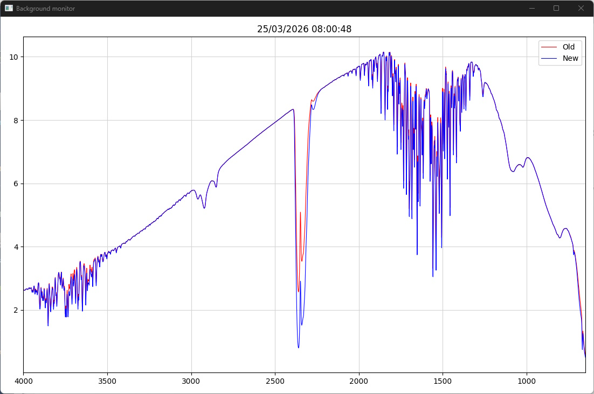
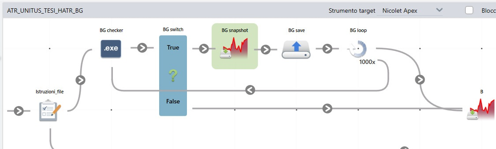

# FT-IR background monitor

This repository contains helper scripts for a Thermo Fisher OMNIC Paradigm workflow used to check background stability during ATR/HATR cleaning.

Included scripts:

- `plot_spectrum.py` copies the OMNIC-exported TSV to `background_stability.tsv`, compares it with `background_stability_old.tsv` and `reference.tsv`, updates `plot_background.png`, and writes `plot_background_metrics.txt`
- `view_plot.py` displays `plot_background.png` in a separate window and refreshes it when the file changes
- `start_view_plot.ps1` starts `view_plot.py` with `pythonw.exe`, so no terminal window is shown

The viewer is started outside OMNIC Paradigm. Inside the OMNIC loop, only `plot_spectrum.py` is executed.

## Files used by the workflow

- `*BG_snapshot*TSV` - OMNIC export file; the name must include the string `BG_snapshot`
- `reference.tsv` - fixed reference background used for comparison
- `background_stability.tsv` - working copy used by `plot_spectrum.py`
- `background_stability_old.tsv` - previous background used for comparison
- `plot_background.png` - image updated by `plot_spectrum.py`
- `plot_background_metrics.txt` - text file containing date, time, RMS values, and max absolute log-ratio values

The figure has four panels: previous vs current spectra, current vs previous background log-ratio, reference vs current spectra, and current vs reference background log-ratio.

## Installation procedure (MS Windows)

Install Scoop from PowerShell (`winget` can also be used):

```powershell
Set-ExecutionPolicy -ExecutionPolicy RemoteSigned -Scope CurrentUser
Invoke-RestMethod -Uri https://get.scoop.sh | Invoke-Expression
```

Install `uv` with Scoop:

```powershell
scoop install uv
```

The use of `uv` is recommended because it simplifies setup and allows Python 3.14 and the required packages to be installed locally for this workflow.

Install Python 3.14:

```powershell
uv python install 3.14
```

Install the Python packages into `.deps`:

```powershell
uv pip install --python 3.14 --target .deps -r requirements.txt
```

## Viewer startup

The viewer is started outside OMNIC Paradigm.

Command:

```powershell
.\start_view_plot.ps1
```

`start_view_plot.ps1` must be edited so that the path to `pythonw.exe` matches the Python installation available on the target PC.

Example of the viewer window:



## Loop example in OMNIC Paradigm

The following cropped screenshot shows the part of the workflow used for the background-check loop:



Loop sequence:

1. `BG checker` is an `EXE` node that runs `plot_spectrum.py`
2. `BG switch` is the user decision node. The question is: "Should the background be checked again?"
3. If the answer is `True`, the background is acquired again
4. `BG snapshot` acquires a new background scan
5. `BG save` creates the OMNIC export TSV file
6. `BG loop` returns to the beginning of the cycle (`1000` loops are set arbitrarily)
7. If the answer is `False`, the loop is exited and the workflow continues

Meaning of the decision:

- `True` indicates that the crystal/module is still dirty and the loop must continue
- `False` indicates that the background is acceptable and the loop can stop (that is, the analysis continues with sample measurement)

## EXE node configuration

Inside the repeated OMNIC cycle, add an `EXE` node.

Set it as follows:

- `Executable`: full path to `python3.14` or `python.exe`
- `Argument`: full path to `plot_spectrum.py`

## Operations at each cycle

- `plot_spectrum.py` looks for the OMNIC export TSV matching `*BG_snapshot*TSV`
- when that file is found, it is copied to `background_stability.tsv`
- if `background_stability_old.tsv` does not exist yet, it is created from the first available TSV
- `reference.tsv` is loaded as a fixed comparison background
- the upper-left panel shows the previous background in red and the current one in blue
- the upper-right panel shows the background log-ratio for current vs previous background on the selected CH and fingerprint regions
- the lower-left panel shows the reference background in purple and the current one in blue
- the lower-right panel shows the background log-ratio for current vs reference background on the selected CH and fingerprint regions
- RMS and maximum absolute log-ratio values are written in the ratio subplot titles
- the comparison plot is written to `plot_background.png`
- metrics are appended to `plot_background_metrics.txt`
- `view_plot.py` refreshes the displayed image automatically
- the operator decides whether another background acquisition is needed
